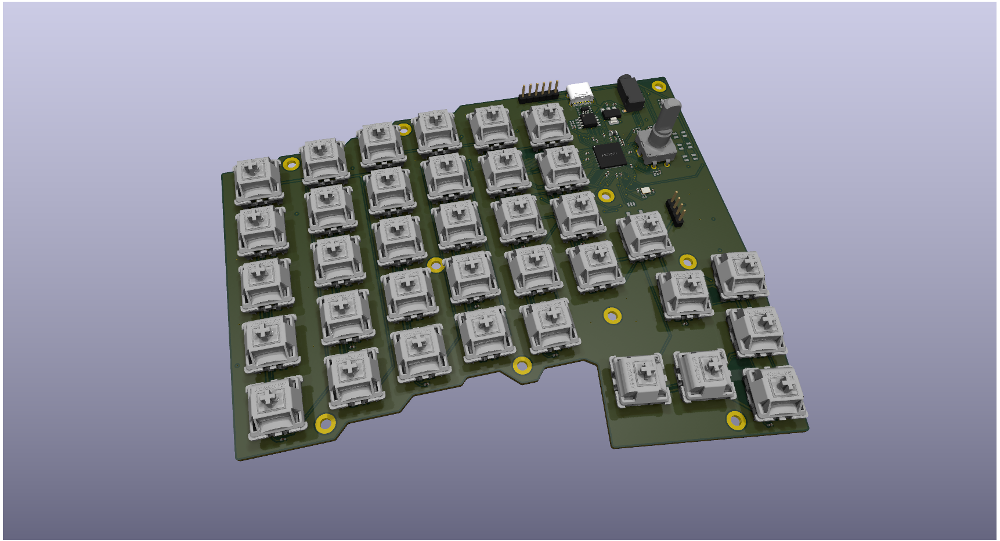
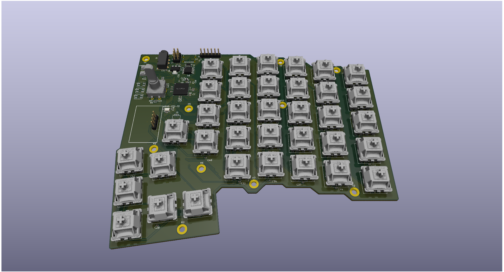

# WOOHOO Keyboard!

This is firmware for custom split keyboard based on based on RP2350B supporting directly wired keys, encoder and optional i2c screen.
The firmware is largely based on the pico-sdk, tiny usb and qmk firmware.

## Schematic:

The keyboard uses RP2350B as the microcontroller - directly connecting to keys:

## Left Board Rendering:

## Right Board Rendering:

